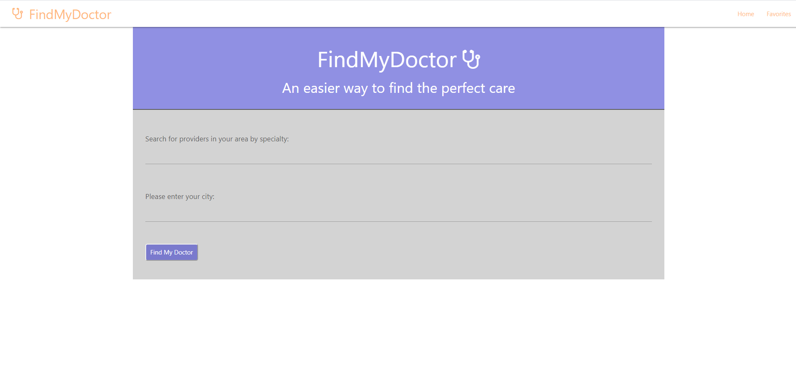

# FindMyDoctor

GIVEN I am in need of medical care
WHEN I specify specialty and my location
THEN I will receive a list of nearby providers and a map

Our FindMyDoctor app is designed to provide our users with local doctors and specialists that are specific to their needs.
This application takes in the desired location and specialty input of user, and returns a list of doctors in their area via BetterDoctor API. Each doctor's name, description, clinic, and contact information are provided to the user. Using GoogleMaps API, the user may choose to show on a map exactly where each doctor is located. Our application is also capable of saving users favorite doctor within their local storage for future reference.

# Our Home Page

User is required to search for health providers by location with the option of also inputing desired specialty. The user is then provided with a list of doctors practicing near the desired location and specializing in the desired specialty.

# Our Search Results

Our search results are displayed in a list of clickable doctor names. Each name when clicked slides down with the specified doctors detailed information. This includes specialty, description, clinic, address, phone number, and the option of a map provided by google maps API.

# Our Favorite Doctors List

Our favorites list is deisplayed similarly to our results list and is populated though local storage. Once the user adds a doctor to the list, it should be there whenever they load the page.

# Utilized Technologies

LocationIQ: https://locationiq.com/
  This API allows us to take in a city, zip code, or full address and gives us back coordinates in return.
  
BetterDoctor: https://betterdoctor.com/
  This API takes in the coordinates we received from the LocationIQ and a "doctor specialty" and provides us with a JSON object with         relevant data.
  
GoogleMaps: https://developers.google.com/maps/documentation/
  This API takes in the coordinates from BetterDoctor and provides a map with a maker indication the practices exact location.
  
Materialize: https://materializecss.com/
  The Materialize framework is used to help us style various aspects of our application.
  
  

